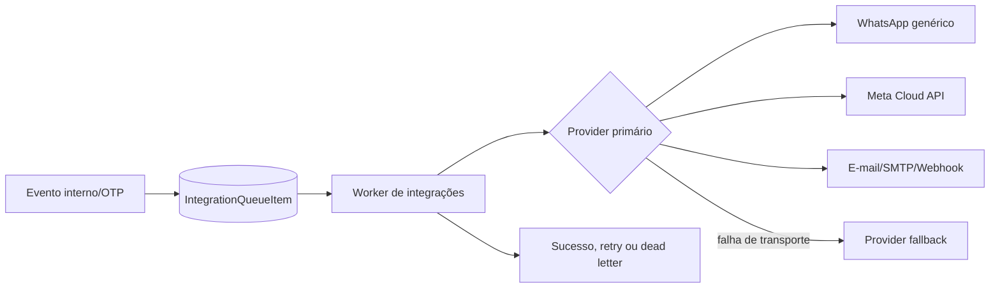
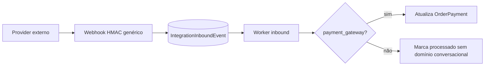

# Levantamento do atendimento por IA e WhatsApp

## Resultado executivo

O código-fonte histórico descrito como contendo atendimento, RAGs, NATS, filas, agentes, histórico, chatbot e WhatsApp **não está entre os artefatos locais disponíveis**. Portanto, este documento não atribui ao legado tabelas, rotas ou fluxos que não puderam ser verificados.

O que existe hoje no NALVEN é uma camada de integrações e mensageria transacional. Ela envia mensagens por WhatsApp, mantém credenciais, templates, health checks, uma fila de entrega e um receptor genérico de webhooks. Isso **não equivale** a uma central de atendimento: não há conversa, mensagem recebida persistida como chat, caixa de entrada, fila de atendimento, agente humano/IA, RAG ou widget público.

## Fontes examinadas

| Fonte | Conteúdo encontrado | Conclusão |
|---|---|---|
| `/home/nalven/nalven-backup-before-v9-20260826-1320` | `src/server.ts`, uma UI Vite e banco básico | Não contém o módulo descrito. |
| Manifesto de `NALVEN-codigo-fonte-completo-v9.zip` preservado no histórico da instalação | Uma página Next, `/api/erp`, `/api/saas`, schema Drizzle, worker e arquivos de build | Não contém atendimento, RAG, NATS, agentes, chatbot ou WhatsApp. |
| Repositório atual `/home/nalven/nalven` | Integrações transacionais, WhatsApp de saída, fila, health, auditoria e orçamento de IA | Há componentes reaproveitáveis, mas o domínio de atendimento ainda não existe. |
| Dependências atuais | Nenhum cliente NATS, Redis/BullMQ, SDK de LLM, pgvector, WebSocket ou SSE | Não há runtime conversacional oculto nas dependências. |

Não há diretório `.git` nos dois snapshots, remoto configurado, ZIP histórico remanescente ou outro checkout em `/home`, `/srv` ou `/var/www` que permita recuperar uma revisão anterior.

## Matriz de existência no NALVEN atual

Legenda: **sim** = implementação operacional encontrada; **parcial** = infraestrutura adjacente; **não** = domínio/fluxo não encontrado.

| Área solicitada | Estado | Evidência e limite atual |
|---|---|---|
| Central de atendimento | **não** | Não existe página, API nem modelo de conversa. |
| Conversas e mensagens | **não** | Não existem entidades `Conversation`/`Message` nem vínculo canal-contato. |
| Filas de atendimento | **não** | `IntegrationQueueItem` é fila técnica de envio; não distribui conversas a atendentes. |
| Agentes humanos | **não** | Usuários e permissões existem, mas não há presença, capacidade, distribuição ou posse de conversa. |
| Agentes de IA | **não** | Há credencial e orçamento de IA, porém não há prompt, execução de modelo, ferramentas, memória ou handoff. |
| RAG/base de conhecimento | **não** | Não há documentos, chunks, embeddings, busca vetorial, coleções ou citações. |
| NATS | **não** | Nenhum pacote, conexão, subject, stream, consumer ou configuração NATS foi encontrado. |
| Histórico de atendimento | **não** | Há auditoria e health de integrações, mas não timeline conversacional. |
| Notas internas | **não** | Existem notas de pedidos; não existem notas privadas de atendimento. |
| Chatbot/widget no site | **não** | Não há script incorporável, sessão anônima, launcher, janela de chat ou API pública de chat. |
| WhatsApp genérico | **sim** | Envia texto por `POST {base_url}/messages`; gerencia status/restart/disconnect da instância. |
| WhatsApp Cloud API | **sim** | Envia texto/template pela Graph API e sincroniza templates aprovados. |
| Entrada de WhatsApp | **parcial** | O webhook genérico valida HMAC e persiste o evento, mas o worker só reconcilia pagamentos; não cria conversa/mensagem. |
| Fila técnica de mensagens | **sim** | Retentativas, backoff, dead letter, fallback de transporte, opt-out e ID remoto. |
| Configurações de IA | **parcial** | Provider, endpoint, chave, modelo, temperatura, tokens, reasoning, orçamento e limites por funcionalidade. |
| Configurações de WhatsApp | **sim** | Credenciais cifradas por tenant, múltiplas contas, conta padrão, health e templates. |
| Métricas | **parcial** | Entrega/erro/OTP e uso de IA; não há SLA, primeira resposta, resolução, CSAT ou produtividade de agentes. |
| Suporte do cliente SaaS | **separado** | `/portal?area=suporte` consome tickets do Billing; não é atendimento omnichannel do tenant. |

## Como os recursos existentes funcionam

### WhatsApp e envio transacional

O catálogo declarativo está em `lib/integrations/catalog.ts` e possui dois adapters:

1. `whatsapp_api`: `base_url`, `api_key`, `connection_id` e `timeout_sec`;
2. `whatsapp_official`: `phone_number_id`, `business_account_id`, `access_token` e `api_version`.

Os segredos são separados da configuração e cifrados. `lib/integrations/providers.ts` envia:

- provider genérico: `POST {base_url}/messages` com instância, número e texto;
- Meta Cloud API: `POST /{version}/{phone_number_id}/messages`, com texto livre ou template.

O painel `/erp/integracoes`, implementado em `components/erp/integration-center.tsx`, permite múltiplas credenciais, conta padrão, teste de saúde, consulta/restart/disconnect de instâncias genéricas e sincronização de templates oficiais.

### Fila existente

`scripts/process-integrations.ts` consome `IntegrationQueueItem` em lotes de 100. Cada item é reclamado por mudança atômica de `pending` para `processing`, verifica opt-out, resolve provider primário/fallback e registra sucesso ou falha. Falhas de transporte usam backoff de 30 s, 2 min, 10 min, 1 h, 6 h e 24 h; falha de negócio ou limite de tentativas vira `dead`.

Essa fila transporta uma mensagem já pronta. Ela não representa espera de cliente, fila/departamento, prioridade de atendimento, round-robin, SLA ou transferência entre agentes.

### Entrada de webhooks

`app/api/webhooks/integrations/[organizationId]/[provider]/route.ts` exige evento, timestamp, HMAC, janela anti-replay, limite persistente e deduplicação. O payload redigido entra em `IntegrationInboundEvent`.

O processamento atual reconhece somente `payment_gateway` para atualizar pagamentos. Um evento recebido de `whatsapp_api` ou `whatsapp_official` pode ser aceito, mas não é normalizado como mensagem, não resolve contato e não abre atendimento.

### IA existente

O provider `ai` testa o endpoint `/models`. As configurações guardam modelo, temperatura, tokens, esforço de raciocínio, parâmetros de imagem, orçamento mensal e limites por funcionalidade. `/api/erp/integrations/ai/usage` apenas contabiliza consumo sob trava transacional.

Não existe chamada ao modelo, prompt de sistema, tool calling, memória, moderação, RAG, avaliação ou roteamento IA/humano.

## Fluxos comprovados no estado atual

## O que precisa ser recuperado do legado

Para produzir o mapa histórico pedido — em vez de um desenho novo — é necessário um destes identificadores da fonte correta:

- caminho local do checkout/ZIP;
- URL do repositório e branch/tag/commit;
- backup que contenha backend, frontend e migrações do módulo.

O mínimo para paridade confiável é:

1. schemas/migrations do banco;
2. rotas/controllers/services/workers;
3. páginas e componentes do inbox e do chatbot;
4. arquivos de configuração com segredos removidos;
5. manifests de dependências e infraestrutura (NATS, workers, scheduler);
6. documentação ou fixtures dos payloads WhatsApp.

Com essa fonte, o levantamento final deve registrar, arquivo por arquivo:

- ciclo de vida de conversa e mensagem;
- canais, contatos, identidades e deduplicação;
- filas, departamentos, skills, prioridades, SLA e distribuição;
- agentes humanos, presença, permissões, transferência e encerramento;
- agentes de IA, prompts, ferramentas, memória, custos e handoff;
- RAGs, ingestão, chunks, embeddings, busca, versionamento e citações;
- subjects/streams/consumers NATS, retry, DLQ e idempotência;
- timeline, notas, tags, anexos, avaliações e auditoria;
- widget web, autenticação da sessão, tempo real, upload e personalização;
- WhatsApp oficial/não oficial, webhooks, mídia, status, templates e janela de 24 h;
- todas as configurações, defaults, validações e permissões;
- matriz legado → NALVEN atual → ação de migração.

## Fronteira para a futura implementação

Os componentes atuais que podem ser reaproveitados são cofre de credenciais, adapters de saída, health checks, templates oficiais, segurança de webhook, rate limit, opt-out, auditoria e mecanismo de retry. O domínio de atendimento deve ter tabelas e serviços próprios; `IntegrationQueueItem`, `IntegrationInboundEvent`, tickets do Billing e notas de pedido não devem ser reutilizados como conversas.

Este levantamento permanece deliberadamente sem uma descrição fictícia do legado. A paridade histórica só pode ser concluída após receber a fonte correta.
