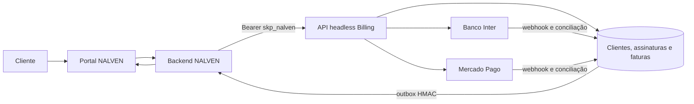
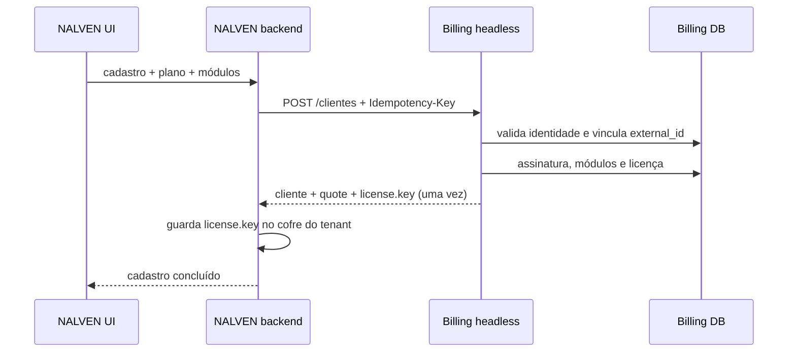
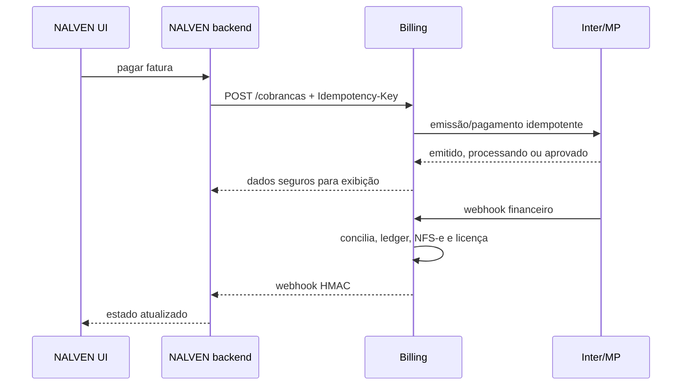

# Integração headless e paridade total NALVEN ↔ Billing Expresso

Versão do contrato: **3.0.1** (implementada pelo NALVEN; compatível com clientes 3.0.0)  
Base de produção: `https://sistema.agenciaexpresso.com.br/api/v1/saas`  
Produto: `nalven`

Este é o documento normativo para o NALVEN operar seu próprio cadastro e portal do cliente enquanto o Billing Expresso permanece como núcleo financeiro. A API aqui descrita está implementada. Ela não reutiliza as rotas legadas `/api/external/*` do Delivery.

## 1. Resultado esperado

O cliente usa somente a interface do NALVEN. O backend NALVEN chama a API headless para:

- criar ou vincular o cliente financeiro;
- definir plano, módulos, vencimento e método preferido;
- refletir upgrades, downgrades, suspensão, reativação e cancelamento;
- montar o portal com faturas, contratos, NFS-e, tickets e licença;
- emitir Pix e boleto pelo Banco Inter;
- tokenizar e pagar cartão pelo Mercado Pago, quando habilitado;
- assinar contratos com OTP sem depender de sessão/cookie do Billing;
- receber eventos financeiros por webhook;
- reconciliar todos os tenants mesmo se um webhook não chegar.



## 2. Fontes de verdade

| Domínio | Fonte de verdade | Espelho/consumidor |
|---|---|---|
| tenant, usuários e dados do ERP | NALVEN | Billing guarda somente `external_id`, URL, ambiente e metadados de vínculo |
| identidade financeira do pagador | Billing | NALVEN envia e exibe a cópia retornada |
| catálogo, preço e promoção | Billing | NALVEN consulta `GET /catalogo`; nunca calcula preço final como autoridade |
| plano e módulos contratados | Billing após comando do NALVEN | NALVEN guarda códigos para UX e reconcilia |
| faturas, pagamentos, caixa e conciliação | Billing | NALVEN exibe pelo portal headless |
| cartão | Mercado Pago/Billing | NALVEN nunca armazena PAN, CVV ou validade |
| Pix e boleto | Banco Inter/Billing | NALVEN exibe código, QR, linha digitável e PDF |
| contratos e evidências | Billing | NALVEN apresenta o fluxo headless |
| tickets do produto | Billing | NALVEN apresenta e responde |
| autorização funcional | licença Billing | NALVEN aplica entitlements e cotas localmente |

O identificador estável entre os sistemas é `external_id`, criado pelo NALVEN e único dentro do produto. Use o slug imutável do tenant; não use e-mail, CNPJ ou ID numérico do Billing como chave de sincronização.

## 3. Segurança e credenciais

### 3.1 Credencial do produto

A credencial headless começa com `skp_nalven_`, pertence ao produto NALVEN e é diferente das chaves `lic_...` de cada instalação.

Ela deve existir apenas no cofre do backend NALVEN:

```http
Authorization: Bearer skp_nalven_...
Accept: application/json
```

`X-Product-Key` é aceito como compatibilidade servidor a servidor, mas `Authorization: Bearer` é o padrão. Nunca coloque essa credencial no JavaScript do navegador, aplicativo móvel, URL, log ou analytics.

O Billing persiste somente SHA-256, prefixo mascarado, escopos, expiração, redes permitidas, limite por minuto e telemetria de uso. O segredo completo aparece uma única vez.

### 3.2 Criação administrativa

Um administrador com `integracoes.gerenciar` cria a credencial:

```http
POST /api/produtos/{produto_id}/saas-credentials
Content-Type: application/json

{
  "nome": "NALVEN produção",
  "ambiente": "producao",
  "scopes": [
    "catalog:read",
    "customers:read",
    "customers:write",
    "subscriptions:read",
    "subscriptions:write",
    "invoices:read",
    "charges:write",
    "contracts:read",
    "contracts:write",
    "tickets:read",
    "tickets:write",
    "licenses:read",
    "licenses:write",
    "portal:read"
  ],
  "redes_permitidas": ["203.0.113.10/32"],
  "requests_por_minuto": 300,
  "expira_em": "2027-08-26T00:00:00Z"
}
```

Rotas administrativas:

| Método | Rota | Finalidade |
|---|---|---|
| `GET` | `/api/produtos/{produto_id}/saas-credentials` | listar metadados e prefixos; nunca devolve segredo |
| `POST` | `/api/produtos/{produto_id}/saas-credentials` | emitir um novo segredo uma única vez |
| `PATCH` | `/api/produtos/{produto_id}/saas-credentials/{id}` | ativar, suspender ou revogar |
| `DELETE` | `/api/produtos/{produto_id}/saas-credentials/{id}` | revogar de forma irreversível |

Produção usa 300 requisições/minuto. A credencial inicial deve expirar em até 12 meses; inicie a rotação 30 dias antes: crie uma segunda credencial do mesmo ambiente, atualize o cofre NALVEN, teste `/catalogo` e só então revogue a anterior. Homologação e produção nunca compartilham segredo.

### 3.3 Escopos

O contrato 3.0.0 possui 14 escopos distintos. As permissões de leitura e escrita abaixo são contadas separadamente; não existe um décimo quinto escopo implícito.

| Escopo | Permite |
|---|---|
| `catalog:read` | catálogo comercial completo |
| `customers:read` / `customers:write` | listar, consultar, criar e atualizar clientes do produto |
| `subscriptions:read` / `subscriptions:write` | ler e mudar plano, módulos e estado da assinatura |
| `invoices:read` | faturas, boleto, NFS-e e documentos fiscais |
| `charges:write` | configuração pública de gateway e emissão/pagamento |
| `contracts:read` / `contracts:write` | contratos, PDF, OTP e assinatura |
| `tickets:read` / `tickets:write` | chamados, respostas e anexos |
| `licenses:read` / `licenses:write` | entitlements e rotação da chave do tenant |
| `portal:read` | snapshot agregado do portal |

Uma credencial não acessa clientes de outro produto. Toda consulta encadeia `produto_id`, `external_id` e o recurso solicitado.

## 4. Convenções HTTP

### 4.1 Idempotência obrigatória

Todo `POST`, `PUT` e `PATCH` headless exige:

```http
Idempotency-Key: nalven:tenant-123:assinatura:versao-42
```

- a chave aceita até 200 caracteres;
- o mesmo payload devolve a resposta persistida;
- a mesma chave com payload diferente devolve `409`;
- uma execução concorrente com a mesma chave devolve `409` e `Retry-After: 2`;
- use a identidade do comando, não um UUID novo a cada retry;
- a retenção padrão é 24 horas.

As respostas idempotentes são cifradas em AES-256-GCM no Billing. Isso permite repetir com segurança uma resposta que contém `license.key` sem guardar a chave em JSON aberto no banco.

### 4.2 Envelope

Sucesso JSON:

```json
{
  "success": true,
  "data": {},
  "request_id": "6f46eab3-..."
}
```

Erro:

```json
{
  "success": false,
  "error": "Mensagem segura e acionável",
  "request_id": "6f46eab3-..."
}
```

Respostas incluem `Cache-Control: no-store`, `X-Request-Id`, `X-RateLimit-Remaining`, `X-RateLimit-Reset` e, no limite, `Retry-After`.

### 4.3 Status e retry

| HTTP | Significado | Ação NALVEN |
|---|---|---|
| `200/201` | concluído | persistir estado/cursor |
| `202` | gateway processando | aguardar `Retry-After`, consultar novamente |
| `400/422` | payload/regra inválida | corrigir; não repetir igual |
| `401` | credencial inválida/expirada | interromper e rotacionar |
| `403` | escopo ou rede insuficiente | corrigir política |
| `404` | vínculo não existe no produto | reconciliar `external_id` |
| `409` | conflito ou idempotência em andamento | reler estado; repetir com mesma chave quando indicado |
| `429` | limite | aguardar `Retry-After` |
| `500/502/503` | falha temporária | retry exponencial com jitter e mesma chave |

## 5. Referência completa da API headless

Todas as rotas abaixo são relativas a `/api/v1/saas`.

### 5.1 Catálogo e configuração de pagamento

| Método | Rota | Escopo | Resposta |
|---|---|---|---|
| `GET` | `/catalogo` | `catalog:read` | produto, planos, preços por método, módulos, recursos, cotas, promoções e métodos atualmente disponíveis |
| `GET` | `/payment-config` | `charges:write` | disponibilidade de Pix/boleto/cartão e chave pública Mercado Pago |

O NALVEN usa os códigos retornados. IDs numéricos servem apenas como referência da resposta atual. Os preços de cartão continuam no catálogo para simulação, mas `payment_methods` só inclui `cartao` quando o Mercado Pago estiver integralmente ativo e com callback assinado.

### 5.2 Clientes e reconciliação

| Método | Rota | Escopo | Finalidade |
|---|---|---|---|
| `GET` | `/clientes?cursor=0&limit=50&updated_since=ISO` | `customers:read` | varredura paginada dos vínculos do produto |
| `POST` | `/clientes` | `customers:write` + `subscriptions:write` | criar/vincular cliente, tenant, assinatura, módulos e licença |
| `GET` | `/clientes/{external_id}` | `customers:read` | cadastro, tenant e assinatura atual |
| `PATCH` | `/clientes/{external_id}` | `customers:write` | contato e endereço; documento fica imutável pela API |

O `GET /clientes` devolve `next_cursor` e `has_more`. Para recuperação de desastre, percorra até `has_more=false`. `updated_since` pode reduzir o conjunto, mas o cursor continua sendo a paginação estável.

Cadastro completo:

```http
POST /api/v1/saas/clientes
Authorization: Bearer skp_nalven_...
Idempotency-Key: nalven:tenant-scalon:cadastro:v1
Content-Type: application/json

{
  "external_id": "tenant-scalon-modas",
  "razao_social": "Scalon Modas Ltda",
  "nome_fantasia": "Scalon",
  "tipo_pessoa": "PJ",
  "documento": "11.222.333/0001-81",
  "inscricao_estadual": "",
  "responsavel": {
    "nome": "Responsável",
    "email": "financeiro@cliente.com.br",
    "telefone": "49999999999",
    "cpf": "52998224725"
  },
  "endereco": {
    "cep": "89800000",
    "logradouro": "Rua Exemplo",
    "numero": "100",
    "complemento": "Sala 2",
    "bairro": "Centro",
    "cidade": "Chapecó",
    "estado": "SC"
  },
  "plano_codigo": "profissional",
  "forma_pagamento": "pix",
  "modulos": ["ecommerce", "marketplaces"],
  "dia_vencimento": 12,
  "tenant": {
    "nome": "Scalon — NALVEN",
    "url": "https://scalon.nalven.com.br",
    "ambiente": "producao",
    "versao": "1.0.0",
    "metadata": { "regiao": "sa-east-1" }
  }
}
```

O Billing valida CPF/CNPJ, telefone, e-mail, plano, módulos e preços. Se o documento já existir com o mesmo e-mail, vincula o cliente central existente ao NALVEN. Se o documento existir com outro e-mail, devolve `409` e exige conferência administrativa para impedir tomada de conta por CNPJ conhecido.

Na primeira criação da licença, a resposta contém `license.key` uma única vez. O backend NALVEN deve armazená-la no cofre do tenant.

### 5.3 Assinatura

| Método | Rota | Escopo | Finalidade |
|---|---|---|---|
| `GET` | `/clientes/{external_id}/assinatura` | `subscriptions:read` | estado, plano, valores, módulos e vencimento |
| `PUT` | `/clientes/{external_id}/assinatura` | `subscriptions:write` | substituir configuração comercial vigente |
| `POST` | `/clientes/{external_id}/assinatura/acoes` | `subscriptions:write` | suspender, reativar ou cancelar |

Mudança de plano/módulos:

```json
{
  "plano_codigo": "omnichannel",
  "forma_pagamento": "cartao",
  "modulos": [],
  "dia_vencimento": 15
}
```

`modulos` contém somente adicionais desejados. Módulos já incluídos no plano não são cobrados novamente. O servidor recalcula `valor_plano_mensal`, `valor_modulos_mensal`, `valor_mensal` e entitlements.

Ações:

```json
{ "acao": "suspender", "motivo": "Solicitação operacional do cliente" }
```

```json
{ "acao": "reativar" }
```

```json
{ "acao": "cancelar", "motivo": "Encerramento solicitado em 26/08/2026" }
```

Suspensão externa é marcada como administrativa. Suspensão automática por inadimplência continua sendo responsabilidade do Billing.

### 5.4 Portal agregado

```http
GET /clientes/{external_id}/portal
```

Escopo: `portal:read`.

Retorna em uma chamada: cadastro, instalação, assinatura, a primeira página de 50 faturas, contratos do produto, tickets do produto, licença/entitlements e métodos de pagamento. É ideal para SSR inicial. O histórico completo de faturas usa a rota paginada específica.

### 5.5 Faturas, Pix, boleto e cartão

| Método | Rota | Escopo | Finalidade |
|---|---|---|---|
| `GET` | `/clientes/{external_id}/faturas?status=pendente&cursor=&limit=50` | `invoices:read` | listar faturas do produto com cursor |
| `GET` | `/clientes/{external_id}/faturas/{fatura_id}` | `invoices:read` | detalhar fatura |
| `POST` | `/clientes/{external_id}/faturas/{fatura_id}/cobrancas` | `charges:write` | emitir Pix/boleto ou processar token de cartão |
| `GET` | `/clientes/{external_id}/faturas/{fatura_id}/boleto` | `invoices:read` | PDF binário do boleto Inter |

Pix Inter (não existe fallback para Mercado Pago):

```json
{ "metodo": "pix", "gateway": "inter", "reemitir": false }
```

Resposta contém `pix_copy_paste`, `pix_qr_code_base64`, `expires_at`, `status` e `processing`. O navegador pode montar `data:image/png;base64,{valor}`.

Boleto Inter:

```json
{ "metodo": "boleto", "gateway": "inter", "reemitir": false }
```

Resposta contém linha digitável e disponibilidade. O PDF é obtido pela rota binária; o backend NALVEN deve fazer proxy/stream e nunca expor a credencial do produto.

Cartão:

1. O frontend NALVEN obtém a chave pública em `GET /payment-config`.
2. O SDK oficial Mercado Pago tokeniza PAN, validade e CVV diretamente no navegador.
3. O frontend envia somente o token ao backend NALVEN.
4. O backend chama:

```json
{
  "metodo": "cartao",
  "card_token": "token_temporario_mp",
  "installments": 1,
  "cpf": "52998224725",
  "payment_method_id": "visa",
  "issuer_id": 123
}
```

O Billing confirma valor e estado sob lock, envia a mesma `Idempotency-Key` ao Mercado Pago, registra pagamento, liquida a fatura, posta no ledger, emite eventos e agenda NFS-e. `pending/in_process` deve ser mostrado como “processando”; a confirmação final vem por webhook/consulta.

Nunca trafegue número do cartão, CVV ou validade pelo backend NALVEN ou Billing. Não use iframe do portal Billing.

### 5.6 Documentos fiscais

| Método | Rota | Escopo |
|---|---|---|
| `GET` | `/clientes/{external_id}/documentos-fiscais` | `invoices:read` |
| `GET` | `/clientes/{external_id}/documentos-fiscais/{token}/download?tipo=danfse` | `invoices:read` |
| `GET` | `/clientes/{external_id}/documentos-fiscais/{token}/download?tipo=xml` | `invoices:read` |

Os downloads são binários e `no-store`. Faça streaming pelo backend NALVEN.

### 5.7 Contratos embutidos no NALVEN

| Método | Rota | Escopo | Finalidade |
|---|---|---|---|
| `GET` | `/clientes/{external_id}/contratos` | `contracts:read` | listar contratos do produto |
| `GET` | `/clientes/{external_id}/contratos/{token}` | `contracts:read` | corpo congelado, hash e estado |
| `POST` | `/clientes/{external_id}/contratos/{token}/otp` | `contracts:write` | enviar código ao e-mail financeiro |
| `POST` | `/clientes/{external_id}/contratos/{token}/assinar` | `contracts:write` | assinar com OTP e aceite |
| `GET` | `/clientes/{external_id}/contratos/{token}/pdf` | `contracts:read` | PDF com evidências |

Assinatura:

```json
{ "codigo_otp": "123456", "aceite_termos": true }
```

O NALVEN deve mostrar o corpo e `corpo_hash` sem alterá-los. O Billing registra IP, user-agent, signatário, OTP, aceite, horário, eventos e PDF final. O código nunca é devolvido pela API.

### 5.8 Suporte e anexos

| Método | Rota | Escopo | Finalidade |
|---|---|---|---|
| `GET` | `/clientes/{external_id}/tickets?status=aberto` | `tickets:read` | listar chamados NALVEN |
| `POST` | `/clientes/{external_id}/tickets` | `tickets:write` | abrir chamado |
| `GET` | `/clientes/{external_id}/tickets/{token}` | `tickets:read` | chamado, mensagens e anexos |
| `POST` | `/clientes/{external_id}/tickets/{token}` | `tickets:write` | responder |
| `POST` | `/clientes/{external_id}/tickets/{token}/anexos` | `tickets:write` | upload multipart |
| `GET` | `/clientes/{external_id}/tickets/{token}/anexos?anexo_id=123` | `tickets:read` | download binário |

Criação:

```json
{
  "titulo": "Falha na importação de estoque",
  "descricao": "A importação retorna erro desde 10h30.",
  "categoria": "tecnico",
  "prioridade": "alta"
}
```

Categorias aceitas: `pagamento`, `tecnico`, `funcionalidade`, `integracao`, `duvida`, `reclamacao`, `sugestao` e `outro`.

Resposta:

```json
{ "mensagem": "Informações adicionais e passos para reprodução." }
```

Upload usa `multipart/form-data` com `file` e `mensagem_id`, máximo 5 MB; formatos: PDF, TXT, CSV, JPEG, PNG e WebP. Extensão, MIME e assinatura mágica precisam coincidir. O arquivo é recusado quando o antivírus está indisponível (`503 ANTIVIRUS_INDISPONIVEL`) ou detecta conteúdo inseguro; nada é persistido antes da aprovação. Também exige `Idempotency-Key`.

### 5.9 Licença do tenant

| Método | Rota | Escopo | Finalidade |
|---|---|---|---|
| `GET` | `/clientes/{external_id}/licenca` | `licenses:read` | estado e entitlements sem revelar segredo |
| `POST` | `/clientes/{external_id}/licenca/rotacionar-chave` | `licenses:write` | invalidar chave anterior e emitir outra uma vez |

A rotação deve ser rara e coordenada: grave a nova `key`, atualize o cofre do tenant e reinicie/reative a instalação. A resposta nunca poderá ser recuperada depois.

As APIs de runtime continuam separadas e autenticadas pela chave `lic_...` do tenant:

```text
POST /api/v1/licencas/ativar
POST /api/v1/licencas/validar
GET  /api/v1/licencas/entitlements
POST /api/v1/licencas/uso
```

## 6. Webhooks do Billing para o NALVEN

Configure administrativamente em:

```text
POST /api/webhook-subscriptions
POST /api/webhook-subscriptions/{id}/testar
```

O destino nasce pausado, exige URL HTTPS pública e segredo resolvível no cofre multi-produto. Referências `secret_ref=env:...` são compatibilidade legada; novas integrações usam segredo cifrado por registro. O teste seguro ativa a assinatura.

Cabeçalhos:

```http
X-Billing-Signature: sha256=<HMAC-SHA256 do corpo bruto>
X-Webhook-Event: fatura.paga
X-Webhook-Id: 12345
X-Correlation-Id: mp-card-987
```

Eventos recomendados:

```text
cliente.criado
cliente.atualizado
assinatura.atualizada
assinatura.suspensa
assinatura.reativada
assinatura.cancelada
fatura.paga
fatura.vencida
cobranca.criada
cobranca.emitida
cobranca.falhou
pagamento.confirmado
pagamento.estornado
nfse.autorizada
nfse.rejeitada
nfse.cancelada
```

O receptor deve validar HMAC em tempo constante sobre o corpo bruto, persistir `X-Webhook-Id` antes de executar e responder `2xx` somente depois da deduplicação. Webhook invalida cache; não substitui uma consulta de reconciliação. Em 26/08/2026, o receptor de produção respondeu `401` a uma assinatura adulterada, como exigido.

## 7. Fluxos obrigatórios

### 7.1 Cadastro



### 7.2 Pagamento



### 7.3 Upgrade ou downgrade

1. NALVEN consulta `/catalogo` e mostra a simulação.
2. Backend envia `PUT /assinatura` com códigos e chave idempotente ligada à versão da alteração.
3. Billing recalcula preço, persiste módulos e sincroniza licença.
4. NALVEN aplica entitlements retornados/consultados.
5. Downgrade não apaga dados operacionais; bloqueia criação acima da nova cota.

## 8. Reconciliação e prevenção de divergência

Mesmo com webhooks, execute:

- a cada minuto: processar a fila de tenants tocados por eventos pendentes;
- sob comando administrativo: varrer integralmente `GET /clientes` com cursor;
- ao abrir o portal: obter `/portal` sem confiar apenas no cache local;
- antes de uma operação restrita: validar licença/entitlement;
- após timeout de mutação: repetir com a mesma `Idempotency-Key`, nunca criar outro comando;
- guardar `request_id`, `X-Webhook-Id`, `external_id`, chave idempotente e timestamp nos logs do NALVEN, sem segredos.

Política de conflito: Billing vence em estado financeiro, valor, pagamento, contrato e licença; NALVEN vence em identidade do tenant e dados operacionais. Correção cadastral de CPF/CNPJ já vinculado deve passar pelo painel administrativo.

## 9. Mapeamento opcional para MCP

A API REST é o contrato canônico. Um servidor MCP do NALVEN pode expor as operações sem acesso direto ao banco:

| Tool MCP sugerida | Operação REST |
|---|---|
| `billing_catalog_get` | `GET /catalogo` |
| `billing_customer_upsert` | `POST /clientes` |
| `billing_customer_get` | `GET /clientes/{external_id}` |
| `billing_subscription_set` | `PUT /assinatura` |
| `billing_subscription_action` | `POST /assinatura/acoes` |
| `billing_portal_get` | `GET /portal` |
| `billing_invoice_list` | `GET /faturas` |
| `billing_charge_create` | `POST /cobrancas` |
| `billing_contract_sign` | OTP + `POST /assinar` |
| `billing_ticket_create` | `POST /tickets` |
| `billing_license_get` | `GET /licenca` |

O MCP deve executar no backend NALVEN, herdar os mesmos escopos e exigir confirmação humana para cancelar assinatura, rotacionar licença ou iniciar pagamento.

## 10. Go-live

- [ ] criar credenciais separadas para homologação e produção;
- [ ] limitar por CIDR quando o provedor NALVEN tiver egress fixo;
- [ ] armazenar credenciais e chaves de licença em cofre;
- [ ] validar cadastro novo, vínculo por CNPJ e conflitos `409`;
- [ ] validar plano e módulos de todos os níveis;
- [ ] validar Pix, QR, boleto, PDF e baixa Inter;
- [ ] validar tokenização e pagamento de cartão sem PAN no backend;
- [ ] validar NFS-e e downloads;
- [ ] validar contrato, OTP, assinatura e PDF;
- [ ] validar ticket, resposta, upload e download;
- [ ] validar suspensão, carência, pagamento e reativação da licença;
- [ ] configurar webhook por produto, testar HMAC e replay;
- [ ] executar reconciliação completa por cursor;
- [ ] simular timeout e retry com a mesma chave idempotente;
- [ ] rotacionar uma credencial de homologação;
- [ ] confirmar observabilidade sem dados pessoais ou segredos;
- [ ] somente após o aceite definir `produtos_saas.publicado=true` para `nalven`.

O NALVEN informado para o primeiro aceite está em `https://nalven.com.br`, versão `0.9.0`, release `20260826195946`, usa `organization.slug` como `external_id`, cache de licença por 300 segundos e releases imutáveis com rollback de symlink. O contrato 3.0.1 e os proxies privados foram implementados; a validação ponta a ponta permanece condicionada às duas credenciais instaladas diretamente nos cofres.

Enquanto o produto estiver não publicado, o cadastro público do Billing continua bloqueado. A API headless autenticada funciona para homologação e produção controlada porque valida produto ativo e credencial, sem depender da publicação do catálogo público.
