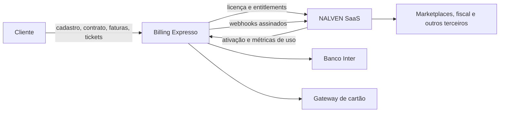

# Arquitetura e fluxos

## Fonte de verdade

| Domínio | Fonte |
|---|---|
| Empresa, responsável e contatos financeiros | Billing |
| Plano, preço, promoção e ciclo | Billing |
| Contrato e evidências de assinatura | Billing |
| Fatura, pagamento, NFS-e e inadimplência | Billing |
| Ticket e SLA de atendimento | Billing |
| Licença, status, recursos e cotas contratadas | Billing |
| Tenant, usuários do ERP e dados da operação | NALVEN |
| Consumo real das cotas | NALVEN, reportado ao Billing |

## Onboarding recomendado

1. O usuário inicia em `/cadastro?produto=nalven` no Billing, inclusive quando chega por botão dentro do site NALVEN.
2. O Billing cria cliente, credencial do portal, assinatura, instalação lógica e licença.
3. O segredo `lic_...` é exibido uma única vez. Ele deve ser transferido ao cofre do tenant NALVEN; nunca salve em log, analytics, URL ou localStorage.
4. O NALVEN chama `POST /api/v1/licencas/ativar` com `produto_codigo=nalven` e o `instance_id` retornado pelo cadastro.
5. O NALVEN consulta entitlements, cria o tenant e habilita apenas os recursos concedidos.
6. O Billing envia `cliente.criado` ao webhook do produto, depois que o destino de homologação estiver configurado.
7. O cliente assina a minuta no portal e acompanha cobrança e suporte no Billing.

O segredo da licença não é incluído no webhook. A primeira transferência deve ocorrer no fluxo seguro de ativação. Para automação sem intervenção, a equipe NALVEN deverá implementar uma troca de código de uso único; não envie a licença em webhook ou e-mail aberto.

## Runtime

- Valide a licença no boot e periodicamente.
- Consulte entitlements após `plano.alterado`, `limites.atualizados`, `assinatura.reativada` e no início de cada sessão administrativa.
- Mantenha cache curto apenas para continuidade; nunca prolongue uma licença após o fim da carência informada.
- Bloqueie criação/ativação de objetos acima da cota. Preserve leitura e exportação quando possível.
- Registre uso de forma idempotente no fechamento do período e em mudanças relevantes de cota.

## Inadimplência

1. O Billing marca a fatura vencida e emite eventos.
2. Após a regra de tolerância operacional, a assinatura é suspensa e a licença é sincronizada.
3. O NALVEN recebe webhook ou detecta a suspensão na próxima validação.
4. Durante carência válida, mostre aviso e mantenha acesso conforme a resposta da API.
5. Fora da carência, restrinja funções mutáveis e direcione o cliente ao portal financeiro.
6. Após confirmação do pagamento, a assinatura/licença é reativada e o NALVEN reconsulta entitlements.

## Upgrade, downgrade e cancelamento

- Upgrade: efeito imediato e possível pró-rata; reconsulte a licença logo após o evento.
- Downgrade: próximo ciclo; antes de efetivar, mostre quais dados/objetos excedem o novo limite.
- Cancelamento mensal: aviso de 30 dias.
- Exportação: solicitação em até 30 dias após encerramento.
- Eliminação: até 60 dias depois da janela, ressalvadas obrigações legais e backups rotativos.

## Contas e autenticação

A senha do portal Billing e a senha do ERP NALVEN são domínios distintos. O NALVEN não deve receber, replicar ou validar o hash do portal. Para o primeiro go-live, use link claro para o portal financeiro. SSO poderá ser adicionado depois por fluxo OAuth/OIDC próprio, sem compartilhar senhas.

